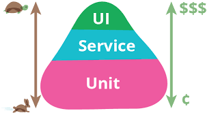

# Session 1: Testing & TDD
Learning about testing and TDD.

# Objectives
 During this session, we'll accomplish the following objectives:
 
 * Testing
 * TDD

# [Lesson 1: Testing](lesson-1.md)

Testing is the process of evaluating a system or its component(s) with the intent to find whether it satisfies the specified requirements or not.

Testing is used at key checkpoints in the overall process to determine whether objectives are being met. 

# [Lesson 2: Test Driven Development (TDD)](lesson-2.md)

Test-driven development (TDD) is a development technique where you must first write a test that fails before you write new functional code.

# Resources

* [Testing](http://agiledata.org/essays/tdd.html)
* [Slides](TDD.pdf)

